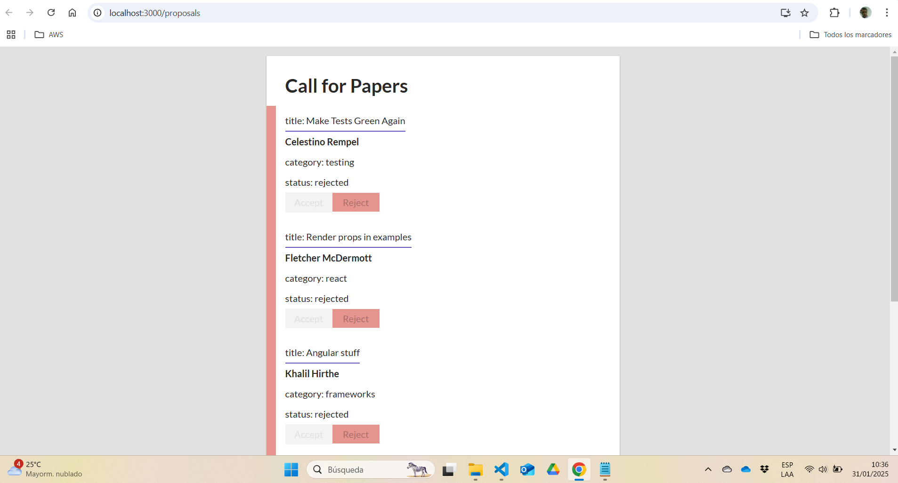

# Conference Admin Panel

Demo: https://edgarinhm.github.io/lumen-admin-panel-react-challenge



screenshot test:


You are creating an [MVP](https://en.wikipedia.org/wiki/Minimum_viable_product) of a conference admin panel.

This task uses **React Hooks**, **React Router** and **React Testing Library (`@testing-library/react`)**.

This app was created with [CRA](https://create-react-app.dev).

## Introduction

Your task is to complete the simple conference admin panel application to enable the conference Committee Members to manage the `Call for Papers` process:
  - make all tests pass by implementing missing features in the production code.
  - make the app work in a way described below.  The majority of the code is committed but there are some missing pieces to implement.
  - you shall stick to the names of the props and components, so that tests don't break.

## Problem Statement

You are expected to implement missing code used within two subpages:
  - `<ProposalListPage>`: list of available talk proposals (`ConferenceTalkProposal`). They can be accepted or rejected by the conference Committee. Clicking on a given proposal redirects to its details.
  - `<ProposalDetailsPage>`: displaying talk details (`ConferenceTalkDetails`). Clicking the _"back to Call for Papers"_ button redirects to the proposals list.

### 1. List of proposals

`<ProposalListPage>` should be rendered under `/proposals` URL path and display list of proposals fetched from API (without any sorting nor paging applied).

1. For every proposal following data should be rendered:
  - talk title,
  - speaker's name,
  - talk category, prefixed with `category: `,
  - status description: _"rejected"_, _"accepted"_, _"to be decided"_ or _"(unknown)"_ (for any unexpected status), prefixed with `status: `. You need to map existing statuses into these descriptions,
  - color bar and label indicating whether the proposal was accepted (green), declined (red), or not decided yet (neutral),
  - button to accept proposal (if not accepted),
  - button to reject proposal (if not rejected).

  The Fake API will preserve changed status of the proposal as long as a user doesn't refresh a page in a browser (navigate inside the app instead).

1. CSS class of the listed proposal has to match its status.

2. Every proposal should be clickable and should navigate on click
    to its `<ProposalDetailsPage>`.

3. Clicking on the accept or reject buttons should send an API request to change the  proposal status to `"accepted"` or `"rejected"` respectively. Proposal status on the list should be updated accordingly.

  The accept button should have a class name similar to that of reject button (already present in the code).

4. `<Loading>` should be rendered during data fetch.

5. Note that you cannot obtain a full set of required data from just one API endpoint – you cannot change the fact that proposals' data is a subset of `/talks` endpoint's response while their statuses come from `/callForPapers` endpoint.

### 2. Proposal details

`<ProposalDetailsPage>` should be rendered under `/proposals/:proposalId` URL path (where `proposalId` is ID of such proposal) and display details fetched from API.

1. Details to render are:
   - speaker's name,
   - talk category,
   - talk title,
   - talk description – split into separate `<p>` for each paragraph (on `\n` character),
   - button which navigates back to `<ProposalListPage>`.

2. `<Loading>` should be rendered during data fetch.

3. `<NotFound>` should be rendered if there is no proposal for a given `proposalId`.

### Fake Backend

Please, be aware there is no real backend behind the app. When starting the application (`npm start`), the app will automatically register a fake backend API defined in `src/api/fakeHttpApi.js`. In order to make HTTP requests, methods from `src/api/httpApi.js` should be called. HTTP requests have random latency simulated – you can expect them to take from 0 to 2 seconds.

In tests, all requests are mocked using `axios-mock-adapter`.

### Hints

1. Changes have to be done in:
   - `src/App.jsx`,
   - files inside `src/proposals/` and its subdirectories.
2. Mock objects are created using functions in the `src/api/mocks.js` file. Each function creates objects with proper structure, allowing to specify only relevant properties (leaving all the rest filled with defaults).
3. For your convenience, **precise model** is described below. Please pay attention to which data structures are used where:

```ts
type ProposalStatus = "accepted" | "rejected" | "pending" | "unknown"

interface ConferenceTalk {
  readonly id: string;
  readonly title: string;
  readonly speaker: string;
  readonly category: string;
}

interface ConferenceTalkDetails extends ConferenceTalk {
  readonly description: string;
}

interface ConferenceTalkProposal extends ConferenceTalk {
  readonly status: ProposalStatus;
}

interface CallForPapers {
  readonly byTalkId: {
    readonly [talkId: string]: {
      readonly status: string;
    }
  };
}
```

## Setup

Follow these steps for correct application setup:

1. `npm install` – install dependencies
2. `npm test` – run all tests (should fail unless you fix the app)
3. `npm start` – serve the app at [http://localhost:3000/](http://localhost:3000/) (it automatically opens the app in your default browser)

There is also the `npm run test:watch` command available that starts the `jest` test runner in the watch mode. It enables choosing tests that are related to modified files only.

**Good Luck!**
